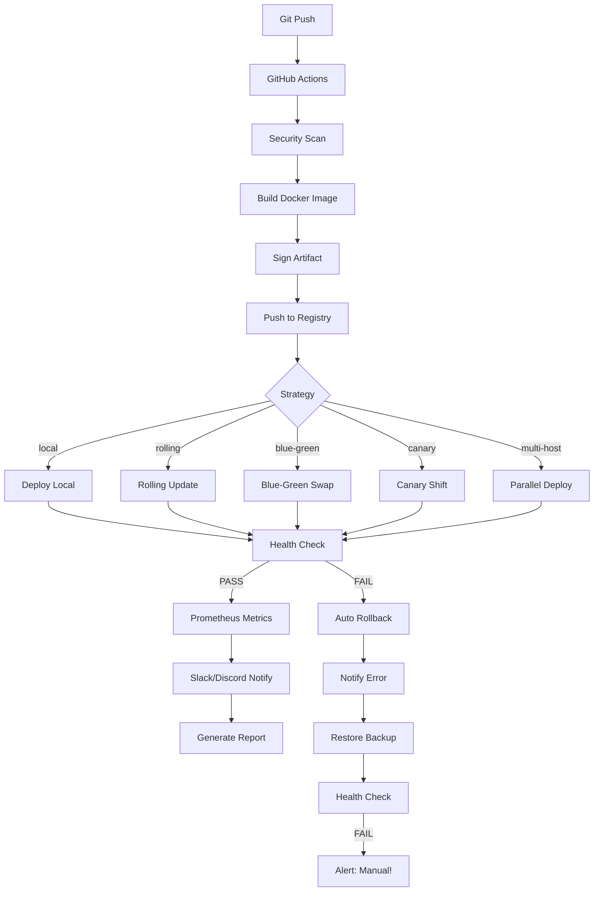

# Automated Deployment System

Automatyczny system wdrażania aplikacji oparty na Bash, wspierający wiele środowisk, strategii wdrożeń oraz integracji z narzędziami obserwowalności i bezpieczeństwa.

---

## Spis treści

1. [Opis](#opis)
2. [Architektura](#architektura)
3. [Wymagania](#wymagania)
4. [Instalacja](#instalacja)
5. [Konfiguracja](#konfiguracja)
6. [Użycie](#użycie)
7. [Strategie wdrożeń](#strategie-wdrożeń)
8. [Funkcje systemu](#funkcje-systemu)
9. [Integracje](#integracje)
10. [Bezpieczeństwo](#bezpieczeństwo)
11. [Obsługa błędów i rollback](#obsługa-błędów-i-rollback)
12. [ChatOps](#chatops)
13. [TUI Menu](#tui-menu)
14. [Diagram procesu](#diagram-procesu)
15. [Roadmapa](#roadmapa)

---

## Opis

System umożliwia automatyczne wdrażanie aplikacji z repozytorium Git na serwer docelowy. Wdrożenie przebiega przez zdefiniowany pipeline: pobranie kodu, backup aktualnej wersji, build, testy, skanowanie bezpieczeństwa, wdrożenie, restart usługi, health check oraz generowanie raportu.

W przypadku wykrycia błędu w trakcie health check system automatycznie przywraca poprzednią wersję z kopii zapasowej.

Główne właściwości:
- Wsparcie dla wielu środowisk (development, staging, production)
- Wiele strategii wdrożeń: rolling, blue-green, canary, multi-host
- Dry-run — weryfikacja planu bez wprowadzania zmian
- Automatyczny backup przed każdym wdrożeniem
- Health check z automatycznym rollbackiem
- Eksport metryk w formacie Prometheus
- Powiadomienia przez Discord i Slack
- Interaktywne menu terminalowe (TUI)
- ChatOps — obsługa komend i webhooków

---

## Architektura

```
deploy-system/
├── deploy.sh              # Główny silnik wdrożeń
├── rollback.sh            # Ręczny rollback
├── menu.sh                # Interaktywne TUI (whiptail/dialog)
├── chatops.sh             # Webhook / ChatOps commands
├── docker-compose.yml     # Środowisko demo (Nginx + Prometheus + Grafana)
├── config/
│   ├── production.conf    # Konfiguracja produkcyjna
│   ├── staging.conf       # Konfiguracja staging
│   └── development.conf   # Konfiguracja dev
├── lib/
│   ├── utils.sh           # Logi, kolory, formatowanie, dry-run
│   ├── notification.sh    # Discord + Slack
│   ├── metrics.sh         # Prometheus exporter
│   ├── vault.sh           # HashiCorp Vault secrets
│   ├── security.sh        # Trivy / Grype / GPG
│   └── report.sh          # Generator raportów
├── logs/                  # Logi wdrożeń
├── backups/               # Kopie zapasowe
├── releases/              # Spakowane artefakty
├── reports/               # Raporty Markdown/PDF
└── assets/                # Nginx config, Prometheus config
```

---

## Wymagania

- Bash 4.2+
- `git`, `curl`, `rsync`, `tar`, `gpg` (opcjonalnie)
- `docker` + `docker compose` (opcjonalnie, dla wersji Docker)
- `trivy` lub `grype` (opcjonalnie, security scan)
- `vault` CLI (opcjonalnie, secrets)
- `dialog` lub `whiptail` (opcjonalnie, TUI)
- `pandoc` + `wkhtmltopdf` (opcjonalnie, PDF reports)
- `jq` (opcjonalnie, Vault JSON parsing)

---

## Instalacja

```bash
git clone <repo>
cd deploy-system
chmod +x *.sh lib/*.sh
```

Uruchomienie środowiska demo (Nginx jako stub aplikacji):

```bash
docker compose up -d app
```

Health check będzie dostępny pod `http://localhost:8080/health`.

---

## Konfiguracja

Każde środowisko posiada osobny plik konfiguracyjny w `config/`.

Przykład `production.conf`:

```bash
APP_DIR=/opt/myapp
BRANCH=main
SERVICE_NAME=myapp
HEALTH_URL=http://localhost:8080/health
DEPLOY_STRATEGY=blue-green
DISCORD_WEBHOOK=https://discord.com/api/webhooks/...
SLACK_WEBHOOK=https://hooks.slack.com/services/...
PROMETHEUS_PORT=9100
HOSTS=app01 app02 app03
VAULT_PATH=secret/data/myapp/production
```

Kluczowe zmienne:
- `APP_DIR` — katalog aplikacji na serwerze
- `BRANCH` — gałąź Git do wdrożenia
- `SERVICE_NAME` — nazwa usługi systemd lub kontenera Docker
- `DEPLOY_STRATEGY` — `rolling`, `blue-green`, `canary`, `local`
- `HOSTS` — lista serwerów docelowych (spacja jako separator)
- `HEALTH_URL` — endpoint do weryfikacji działania

---

## Użycie

### Podstawowe wdrożenie

```bash
./deploy.sh production
./deploy.sh staging
./deploy.sh development
```

### Dry Run

Symulacja wdrożenia bez wprowadzania zmian na serwerze:

```bash
./deploy.sh production --dry-run
```

### Wybór strategii

```bash
./deploy.sh production --strategy blue-green
./deploy.sh production --strategy canary
./deploy.sh production --strategy rolling --parallel
```

### Pominięcie testów lub skanowania

```bash
./deploy.sh production --skip-tests
./deploy.sh production --skip-security
./deploy.sh production --skip-tests --skip-security
```

### Ręczny rollback

```bash
./rollback.sh production backup_20260615_143000_production
```

---

## Strategie wdrożeń

| Strategia | Opis | Przeznaczenie |
|-----------|------|---------------|
| `local` | Wdrożenie na lokalny katalog | Development |
| `rolling` | Nadpisanie aktualnej wersji | Staging, szybkie iteracje |
| `blue-green` | Dwie instancje, swap przez symlink | Production, zero downtime |
| `canary` | Progresywne przekierowanie ruchu | Production, ograniczenie ryzyka |
| `multi-host` | Równoległe wdrożenie na wiele serwerów | Klastry, farmy serwerów |

### Blue-Green

```bash
./deploy.sh production --strategy blue-green
```

Mechanizm:
- `APP_DIR-blue` — aktualnie działająca wersja
- `APP_DIR-green` — nowa wersja wdrażana
- Symlink `APP_DIR` wskazuje aktywną instancję
- W razie błędu — natychmiastowy powrót symlinkiem do wersji blue

### Canary

```bash
./deploy.sh production --strategy canary
```

Mechanizm:
- Nowa wersja startuje z niskim procentem ruchu (`CANARY_START_WEIGHT`)
- Co zadany interwał zwiększane jest obciążenie (`CANARY_STEP`)
- Każdy krok weryfikowany health checkiem
- W razie błędu — natychmiastowy rollback

W produkcyjnej konfiguracji wagi obsługiwane są przez Nginx upstream, Istio lub Envoy.

### Multi-host + Parallel

```bash
./deploy.sh production --parallel
```

Równoległe wdrożenie na wszystkie hosty z listy `HOSTS` za pomocą background jobs (`&`) i `wait`.

---

## Funkcje systemu

### Blue-Green Deployment

Dwie równoległe instancje aplikacji. Przełączanie ruchu odbywa się przez zmianę symlinka, co zapewnia brak przestoju w czasie wdrożenia.

### Canary Deployment

Stopniowe przekierowywanie ruchu na nową wersję. Pozwala wykryć problemy zanim dotkną całej bazy użytkowników.

### Prometheus Metrics

Po każdym wdrożeniu generowane są metryki w formacie OpenMetrics:

```
deploy_duration_seconds 45
deploy_success_total 1
deploy_failure_total 0
deploy_health_check_passed 1
```

Pliki `.prom` eksponowane są przez tymczasowy serwer HTTP (`python3 -m http.server`) na porcie skonfigurowanym jako `PROMETHEUS_PORT`.

### Grafana Dashboard

W `docker-compose.yml` dostępny jest profil `monitoring` z Prometheus i Grafana:

```bash
docker compose --profile monitoring up -d
```

Przykładowe dashboardy: *Deploy Success Rate*, *Average Deploy Time*, *MTTR*.

### Powiadomienia Discord i Slack

Webhooki wysyłają status każdego wdrożenia oraz zdarzenia rollbacku. Konfiguracja przez `DISCORD_WEBHOOK` i `SLACK_WEBHOOK` w pliku `.conf`.

### ChatOps

Obsługa komend terminalowych i webhooków:

```bash
./chatops.sh deploy production
./chatops.sh status production
./chatops.sh rollback production backup_xxx
```

Dostępny jest również stub serwera nasłuchującego na webhooki (np. z Slack, Discord, Mattermost).

### Security Scanning

Przed wdrożeniem system próbuje wykonać skanowanie obrazu Docker:

```bash
trivy image --severity HIGH,CRITICAL myapp:latest
grype myapp:latest --fail-on critical
```

Wykrycie krytycznych podatności wstrzymuje pipeline.

### Vault Secrets

Sekrety (hasła, tokeny, klucze API) pobierane są z HashiCorp Vault przed etapem buildu:

```bash
vault kv get secret/data/myapp/production
```

Wartości wczytywane są do zmiennych środowiskowych. Dzięki temu w repozytorium nie przechowywane są żadne wrażliwe dane.

### Podpisywanie artefaktów (GPG)

Każdy spakowany artefakt (`releases/release_*.tar.gz`) opcjonalnie podpisywany jest kluczem GPG. Przed wdrożeniem weryfikowana jest integralność podpisu.

### Raporty wdrożeń

Po każdym deployu generowany jest raport Markdown w `reports/`:

- Deployment ID
- Git Commit
- Czas trwania
- Strategia
- Status (SUCCESS / FAILED)
- Nazwa backupu
- Logi (ostatnie 50 linii)

Przy dostępności `pandoc` i `wkhtmltopdf` generowany jest również raport PDF.

### TUI Menu

Interaktywne menu terminalowe obsługujące `dialog`, `whiptail` lub fallback tekstowy:

```bash
./menu.sh
```

Opcje menu:
- Deploy to Environment
- Rollback
- View Logs
- Status

---

## Integracje

| System | Plik / Moduł | Opis |
|--------|--------------|------|
| Git | `deploy.sh` stage 1 | Fetch, checkout, pull, commit tracking |
| systemd | `deploy.sh` stage 8 | Restart usługi, sprawdzenie statusu |
| Docker | `deploy.sh` stage 4, 8 | Build obrazu, restart kontenera, compose |
| Prometheus | `lib/metrics.sh` | Metryki deploymentu w formacie OpenMetrics |
| Grafana | `docker-compose.yml` | Wizualizacja metryk |
| HashiCorp Vault | `lib/vault.sh` | Pobieranie sekretów |
| Discord | `lib/notification.sh` | Webhook z powiadomieniami |
| Slack | `lib/notification.sh` | Webhook z powiadomieniami |
| Trivy / Grype | `lib/security.sh` | Skanowanie obrazów Docker |
| GPG | `lib/security.sh` | Podpis i weryfikacja artefaktów |

---

## Bezpieczeństwo

- Brak sekretów w repozytorium — integracja z Vault
- Gate bezpieczeństwa — skanowanie obrazów przed wdrożeniem
- Podpisane artefakty — GPG supply chain security
- Backup przed każdym wdrożeniem — zawsze możliwy rollback
- Health check po wdrożeniu — aplikacja musi odpowiedzieć zanim pipeline zakończy sukcesem
- Dry run — możliwość weryfikacji planu bez modyfikacji serwera

---

## Obsługa błędów i rollback

### Automatyczny rollback

Jeśli health check po wdrożeniu zakończy się błędem:

1. Log błędu i wysłanie powiadomienia
2. Przywrócenie z kopii zapasowej z `backups/`
3. Restart usługi lub kontenera
4. Ponowny health check
5. Jeśli rollback również zawiedzie — wymagana interwencja manualna

### Ręczny rollback

```bash
./rollback.sh production backup_20260615_143000_production
```

Komenda przywraca katalog aplikacji z kopii, restartuje usługę i wysyła powiadomienie.

---

## ChatOps

Przykłady komend:

```bash
./chatops.sh deploy production
./chatops.sh status production
./chatops.sh rollback production backup_20260615_143000_production
./chatops.sh server --port 9000
```

Tryb `server` uruchamia prosty nasłuch webhooków (stub). W środowisku produkcyjnym zaleca się użycie dedykowanego bota lub integracji z istniejącym narzędziem ChatOps.

---

## TUI Menu

```bash
./menu.sh
```

Wymaga `dialog` lub `whiptail`. Jeśli nie są dostępne, wyświetlane jest tekstowe menu oparte na `read`.

---

## Diagram procesu



---

## Roadmap

- [ ] Kubernetes integration (`kubectl apply`, Helm charts)
- [ ] Terraform / OpenTofu pre-deployment infra checks
- [ ] Ingress/Nginx config updater for canary weights
- [ ] Full GitHub Actions workflow (`.github/workflows/deploy.yml`)
- [ ] Vault Kubernetes auth (service account instead of token)
- [ ] PagerDuty / OpsGenie integration for failures
- [ ] Automatic backup rotation (retention policy)
- [ ] Database migration step (pre-deploy / post-deploy hooks)
